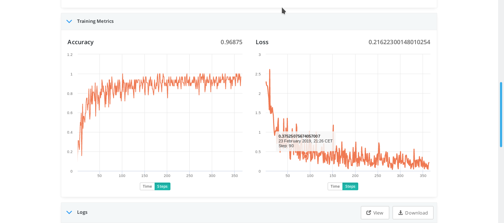

## Introduction
This repository contains a class definition called FloydhubKerasCallback that can be used to keep track of training phase metrics when deploying your deep learning model on a floydhub server using the keras backend  <br/>
Metrics can later be visualized in your floydhub job panel under "Training metrics" at real time <br/>




## Usage

Copy the class FloydhubKerasCallback defined on [this file](train_metrics.py) to your model training script <br/>


Then, instantiate the class and pass the object the 'callbacks' parameter when calling the method fit()

```python
model = Sequential()
# ...
model.compile(...)

callback = FloydhubKerasCallback(mode='batch')
mode.fit(X_train, y_train, epochs=100, verbose=False, callbacks=[callback])

```

Now deploy your model on a floydhub gpu/cpu and train it. Training metrics will be shown on the your floydhub jobs panel at real time
```
floyd init
floyd run --gpu --env keras "python your_script.py"
```


## Example

Clone this repository 
